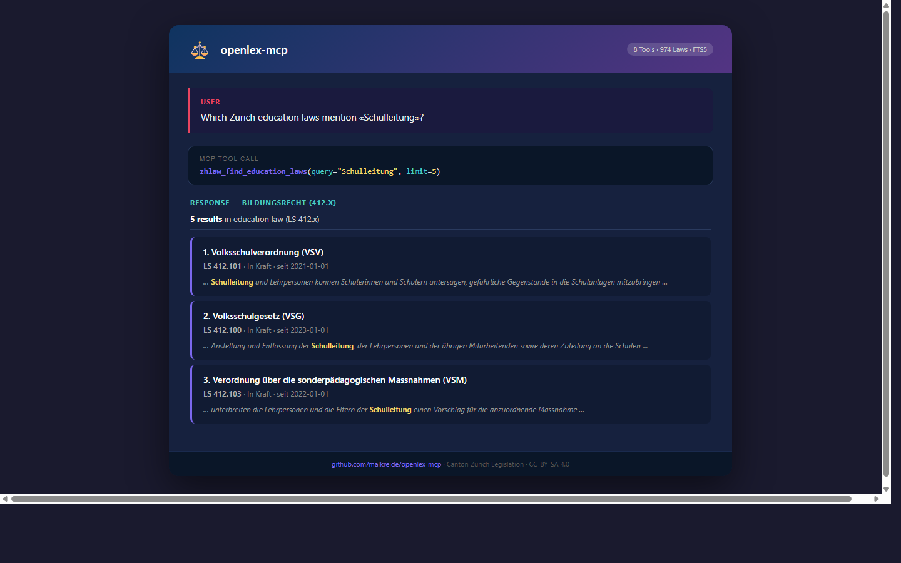

> 🇨🇭 **Part of the [Swiss Public Data MCP Portfolio](https://github.com/malkreide)**

# ⚖️ openlex-mcp


[](https://opensource.org/licenses/MIT)
[](https://www.python.org/downloads/)
[](https://modelcontextprotocol.io/)
[](https://github.com/malkreide/openlex-mcp)

> MCP Server for Canton Zurich legislation (ZH-Lex) — full-text search, article extraction, and education law tools for ~970 cantonal laws

[🇩🇪 Deutsche Version](README.de.md)

<p align="center">
  
</p>

---

## Overview

`openlex-mcp` provides AI-native access to the entire legal collection of Canton Zurich (Zürcher Gesetzessammlung). It combines full-text data from HuggingFace with live metadata from the official zh.ch website, storing everything in a local SQLite database with FTS5 full-text indexing for sub-50ms search performance.

| Source | Data | Access |
|--------|------|--------|
| **HuggingFace** | 974 ZH laws — full text (PDF extracts) | Cached locally as SQLite + FTS5 |
| **zh.ch ZH-Lex** | Current metadata, PDF links, validity status | Live HTTP requests |

Built for the Schulamt (school department) of the City of Zurich, but covers all areas of cantonal law — from tax law to building regulations.

**Anchor demo query:** *"What does the Volksschulgesetz say about parental involvement? Show me Art. 55 VSG and find all articles that mention 'Elternrat'."*

---

## Features

- ⚖️ **8 tools** covering search, retrieval, article extraction, and cache management
- 🔍 **FTS5 full-text search** across ~970 cantonal laws with BM25 ranking
- 📑 **Article extraction** — parse individual articles (Art. / §) with paragraph detection
- 🏫 **Education law shortcuts** — specialized search for LS 412.x series (Volksschulgesetz, Lehrpersonalverordnung, etc.)
- 🌐 **Live metadata** from zh.ch for current validity status and PDF links
- 💾 **Hybrid architecture** — cached full-text (HuggingFace) + live metadata (zh.ch)
- 🔓 **No API key required** — all data under open licenses (CC-BY-SA 4.0)
- ☁️ **Dual transport** — stdio (Claude Desktop) + Streamable HTTP (cloud)

---

## Prerequisites

- Python 3.11+
- [uv](https://github.com/astral-sh/uv) (recommended) or pip
- Internet connection (for initial data download and live metadata)

---

## Installation

```bash
# Clone the repository
git clone https://github.com/malkreide/openlex-mcp.git
cd openlex-mcp

# Install
pip install -e .
# or with uv:
uv pip install -e .
```

---

## Quickstart

```bash
# stdio (for Claude Desktop)
python -m openlex_mcp.server

# Streamable HTTP — binds to 127.0.0.1:8000 by default (localhost only)
python -m openlex_mcp.server --http --port 8000
```

### Network binding

By default the HTTP transport binds to **`127.0.0.1`** (localhost only). The host
and port are configurable via the `MCP_HOST` / `MCP_PORT` environment variables
(or the `--host` / `--port` CLI flags, which take precedence).

**Never** bind to `0.0.0.0` outside a container — it exposes the server to your
local network (NeighborJack risk). For containerized/cloud deployments set
`MCP_HOST=0.0.0.0` explicitly; when that happens outside a detected container the
server logs a warning.

Try it immediately in Claude Desktop:

> *"What is the Volksschulgesetz (VSG)?"*
> *"Find all Zurich laws about data protection"*
> *"Show me Art. 1 of the Volksschulgesetz"*
> *"Which education laws mention 'Schulleitung'?"*

---

## Configuration

### Claude Desktop

Edit `~/Library/Application Support/Claude/claude_desktop_config.json` (macOS) or `%APPDATA%\Claude\claude_desktop_config.json` (Windows):

```json
{
  "mcpServers": {
    "openlex": {
      "command": "python",
      "args": ["-m", "openlex_mcp.server"]
    }
  }
}
```

Or with the installed entry point:

```json
{
  "mcpServers": {
    "openlex": {
      "command": "openlex-mcp"
    }
  }
}
```

**Config file locations:**
- macOS: `~/Library/Application Support/Claude/claude_desktop_config.json`
- Windows: `%APPDATA%\Claude\claude_desktop_config.json`

### Cloud Deployment (SSE for browser access)

For use via **claude.ai in the browser** (e.g. on managed workstations without local software):

**Render.com (recommended):**
1. Push/fork the repository to GitHub
2. On [render.com](https://render.com): New Web Service → connect GitHub repo
3. Set start command: `python -m openlex_mcp.server --http --port 8000`
4. Set environment variable `MCP_HOST=0.0.0.0` so the container is reachable
   (the code default is `127.0.0.1`; Render sets the `RENDER` env var, so no
   NeighborJack warning is logged)
5. Set `MCP_CORS_ORIGINS=https://claude.ai` so the browser can read the
   `Mcp-Session-Id` header (comma-separated list; **no wildcard** — defaults to
   empty, i.e. no cross-origin access)
6. In claude.ai under Settings → MCP Servers, add: `https://your-app.onrender.com/sse`

> 💡 *"stdio for the developer laptop, SSE for the browser."*

---

## Available Tools

### Search & Browse

| Tool | Description |
|------|-------------|
| `zhlaw_search_laws` | Full-text search across all ~970 ZH laws (FTS5 + BM25 ranking) |
| `zhlaw_get_law` | Retrieve a law by LS number (e.g. `412.100`) or abbreviation (e.g. `VSG`) |
| `zhlaw_list_laws` | List and filter laws by legal area prefix |
| `zhlaw_find_education_laws` | Specialized search in education law (LS 412.x series) |

### Article Extraction

| Tool | Description |
|------|-------------|
| `zhlaw_get_article` | Extract a specific article from a law (e.g. Art. 28 VSG) |
| `zhlaw_search_articles` | Search within all articles of a specific law |

### Metadata & Cache

| Tool | Description |
|------|-------------|
| `zhlaw_get_law_metadata` | Get live metadata from zh.ch (PDF links, validity status) |
| `zhlaw_update_cache` | Refresh the local data cache from HuggingFace |

### Key Legal Area Prefixes (LS Numbers)

| Prefix | Legal Area | Example |
|--------|-----------|---------|
| `131` | Constitution and popular rights | Kantonsverfassung |
| `170` | Administrative procedure | Datenschutzgesetz |
| `331` | Tax law | Steuergesetz |
| `412` | Education and schools | Volksschulgesetz (VSG) |
| `700` | Spatial planning and building | Planungs- und Baugesetz |
| `810` | Health | Gesundheitsgesetz |

### Example Use Cases

| Query | Tool |
|-------|------|
| *"What is the Volksschulgesetz?"* | `zhlaw_get_law` |
| *"Find laws about data protection"* | `zhlaw_search_laws` |
| *"Show me Art. 55 VSG"* | `zhlaw_get_article` |
| *"Which education laws mention Schulleitung?"* | `zhlaw_find_education_laws` |
| *"Find all articles about Elternrat in the VSG"* | `zhlaw_search_articles` |
| *"Is LS 412.100 still in force?"* | `zhlaw_get_law_metadata` |

---

## Architecture

```
┌─────────────────┐     ┌──────────────────────────────┐     ┌──────────────────────────┐
│   Claude / AI   │────▶│  OpenLex MCP                 │────▶│  HuggingFace             │
│   (MCP Host)    │◀────│  (MCP Server)                │◀────│  rcds/swiss_legislation   │
└─────────────────┘     │                              │     │  (974 ZH laws, cached)   │
                        │  8 Tools                     │     ├──────────────────────────┤
                        │  SQLite + FTS5 Cache         │────▶│  zh.ch ZH-Lex            │
                        │  Stdio | HTTP                │◀────│  (live metadata + PDFs)  │
                        │                              │     ├──────────────────────────┤
                        │  No authentication required  │     │  LexFind.ch              │
                        └──────────────────────────────┘     │  (links only)            │
                                                             └──────────────────────────┘
```

### Data Source Characteristics

| Source | Protocol | Coverage | Auth | License |
|--------|----------|----------|------|---------|
| HuggingFace `rcds/swiss_legislation` | Datasets API | 974 ZH laws (full text) | None | CC-BY-SA 4.0 |
| zh.ch ZH-Lex | HTTP/HTML | Current metadata, PDFs | None | Public |
| LexFind.ch | HTTP | Cross-cantonal links | None | Public |

---

## Project Structure

```
openlex-mcp/
├── src/openlex_mcp/
│   ├── __init__.py              # Package
│   ├── __main__.py              # Entry point for python -m
│   ├── server.py                # 8 MCP tool definitions (FastMCP)
│   ├── api_client.py            # zh.ch HTTP client + metadata extraction
│   ├── data_cache.py            # SQLite + FTS5 cache management
│   └── law_parser.py            # Article extraction from law texts
├── tests/
│   └── test_server.py           # Unit + integration tests
├── .github/workflows/ci.yml     # GitHub Actions (Python 3.11/3.12/3.13)
├── pyproject.toml
├── claude_desktop_config.json   # Example config for Claude Desktop
├── CHANGELOG.md
├── CONTRIBUTING.md
├── LICENSE
├── README.md                    # This file (English)
└── README.de.md                 # German version
```

---

## Known Limitations

- **HuggingFace dataset:** The `html_content` field is unreliable (cross-contaminated between laws); the server uses `pdf_content` instead, which is correct but has PDF extraction artefacts (hyphenation, layout artefacts)
- **Article parser:** PDF text extraction sometimes merges article boundaries; complex nested articles may not parse perfectly
- **Initial load:** First start requires ~25s to download and index 974 laws from HuggingFace (~38 MB SQLite database)
- **zh.ch metadata:** No official API; metadata extraction relies on HTML patterns that may change
- **Offline mode:** Full-text search works offline after initial load; live metadata requires internet

---

## Safety & Limits

| Aspect | Details |
|--------|---------|
| **Access** | Read-only (`readOnlyHint: true`) — the server cannot modify or delete any data |
| **Personal data** | No personal data — all sources are aggregated, public legal texts |
| **Rate limits** | Built-in per-query caps (max 50 search results, 5000 chars content preview) |
| **Timeout** | 30 seconds per HTTP call to zh.ch |
| **Egress** | Outbound requests are HTTPS-only and restricted to an allow-list (`www.zh.ch`), with SSRF IP-blocking and DNS-pinning — see [docs/network-egress.md](docs/network-egress.md) |
| **Authentication** | No API keys required — HuggingFace dataset is public, zh.ch is open |
| **Licenses** | Law data: CC-BY-SA 4.0 ([rcds/swiss_legislation](https://huggingface.co/datasets/rcds/swiss_legislation)); zh.ch metadata: public |
| **Terms of Service** | Subject to ToS of [HuggingFace](https://huggingface.co/terms-of-service) and [Canton Zurich](https://www.zh.ch/de/rechtliche-hinweise.html) |
| **Disclaimer** | This server provides legal texts for informational purposes only — it does not constitute legal advice |

---

## Testing

```bash
# Unit tests (no API key required)
PYTHONPATH=src pytest tests/ -m "not live"

# Integration tests (live API calls)
pytest tests/ -m "live"
```

---

## Changelog

See [CHANGELOG.md](CHANGELOG.md)

---

## Contributing

See [CONTRIBUTING.md](CONTRIBUTING.md)

---

## License

MIT License — see [LICENSE](LICENSE)

---

## Author

Hayal Oezkan · [malkreide](https://github.com/malkreide)

---

## Credits & Related Projects

- **Data:** [rcds/swiss_legislation](https://huggingface.co/datasets/rcds/swiss_legislation) — HuggingFace dataset (CC-BY-SA 4.0)
- **ZH-Lex:** [zh.ch Gesetzessammlung](https://www.zh.ch/de/politik-staat/gesetze-beschluesse/gesetzessammlung.html) — Official Canton Zurich legal collection
- **LexFind:** [lexfind.ch](https://www.lexfind.ch/) — Cross-cantonal legislation database
- **Protocol:** [Model Context Protocol](https://modelcontextprotocol.io/) — Anthropic / Linux Foundation
- **Related:** [swiss-courts-mcp](https://github.com/malkreide/swiss-courts-mcp) — Law text + case law = complete legal research
- **Related:** [zurich-opendata-mcp](https://github.com/malkreide/zurich-opendata-mcp) — Law text + city council decisions = full context
- **Portfolio:** [Swiss Public Data MCP Portfolio](https://github.com/malkreide)
